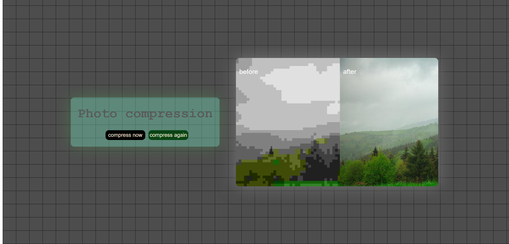

# 🖼️ Photo Compression Tool

A sleek, responsive, and modern web application designed to demonstrate the power of image optimization. This project features a creative UI with a "Before vs After" comparison tool, highlighting the importance of web performance.

## live demo
https://eli-khodayi-dev.github.io/copress

## 📸 Preview

---

## 🚀 Overview

This project is a visual representation of **Web Image Compressor**. It’s not just a tool, but a focused UI/UX experiment where I applied my CSS skills to create a beautiful and functional interface for users who want to optimize their images for the web.

### ✨ Key Features

- **Interactive Comparison:** A visual side-by-side comparison of "Before" (pixelated/high-size) and "After" (optimized/clean) images.
- **Glassmorphism UI:** I used modern CSS techniques like `backdrop-filter` and transparency to create a stylish "glass" effect for the control panel.
- **Glowing Effects:** Custom box-shadows and text-shadows to give the interface a vibrant, tech-focused look.
- **Responsive Layout:** Designed to look great on various screen sizes.
- **Custom Grid Background:** A stylized dark grid background that adds depth and a "pro-workspace" feel to the app.

---

## 🛠️ Technologies Used

- **HTML:** Semantic structure for better accessibility.
- **CSS:** Advanced styling including Flexbox, Grid, Glassmorphism, and custom animations.

---

## 🎨 Design Philosophy

In this project, I focused on:
1. **User Experience (UX):** Making the compression process look effortless and rewarding.
2. **Visual Hierarchy:** Using colors (like the green "compress again" button) to guide user actions.
3. **Contrast:** Balancing the dark background with glowing UI elements to make the content pop.

---

## 👩‍💻 About the Developer

**Eli Khodayi**  
*Frontend Developer based in Iran*

- **LinkedIn:** [linkedin.com/in/eli-khodayi](https://linkedin.com/in/eli-khodayi)
- **GitHub:** [@eli-khodayi-dev](https://github.com/eli-khodayi-dev)
- **Portfolio:** [eli-khodayi-dev.github.io](ht://eli-khodayi-dev.github.io)

---

### 📝 How to use:
1. Open `index.html` in your browser.
2. Observe the comparison between the original and compressed images.
3. Use the "Compress Now" button to simulate the optimization process.

